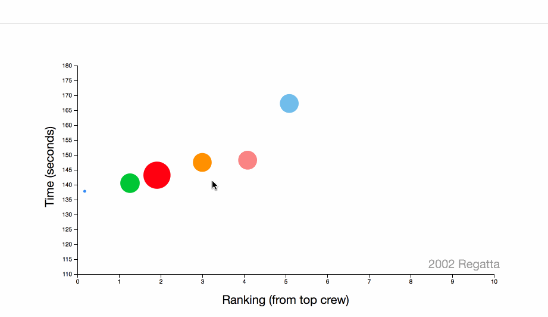

# Competitive Bay Area Dragon Boat in D3.js


This [project](https://cyip.me/dboat "Dboat in D3.js") is a homage to a sport that means so much to me. It's intended to show the rankings of each team throughout the years.

## Technologies
* D3.js for the visualization

## Code Samples

### TimeChart
I made the visualzation into a Class so I can reuse the chart for both Adult and Youth data.

```
TimeChart = function(_parentElement, data){
    this.parentElement = _parentElement;
    this.data = data;
    this.initVis();
};
```
parentElement is where the SVG will be located and the data itself is the JSON

### Data Time Lapse



Datapoints are mapped from the json, and then the time was converted to a Float. Next, pending the race, the points transition to their appropriate position. The dots are removed and then rerendered with a transition so it has that bounce effect.

```
d3.json("data/youth.json").then( (data) => {
    totalData = data;
    youthData = data.map((race) => {
        race.teams.map(
            team => {
                time = team.time.split(":");
                team.time = +time[0] * 60 + parseFloat(time[1]);
                return team;
            });
        return race;
    });

    youthChart = new TimeChart("#chart-area-youth", youthData);
    d3.interval(function () {
        update();
    }, 1500);

});


let circles = vis.g.selectAll("circle").data(vis.data[vis.time].teams);
    // EXIT old elements not present in new data.
    circles.exit()
        .attr("class", "exit")
        .remove();

    // ENTER new elements present in new data.
    circles.enter()
        .append("circle")
        .attr("class", "enter")
        .attr("fill", function (d) { return vis.colors[d.team]; })
        .on("mouseover", vis.tip.show)
        .on("mouseout", vis.tip.hide)
        .merge(circles)
        .transition(vis.t)
        .attr("cy", function (d) { return vis.y(d.time); })
        .attr("cx", function (d) { return vis.x(d.place); })
```


### Resizing Dots
```
    circles.enter()
        .append("circle")
        .attr("class", "enter")
        .attr("fill", function (d) { return vis.colors[d.team]; })
        .on("mouseover", vis.tip.show)
        .on("mouseout", vis.tip.hide)
        .merge(circles)
        .transition(vis.t)
        .attr("r", function (d) { return Math.sqrt(vis.area(d.size)*20 / Math.PI) });
```
The dots size is represented by the crew count of each team.

## Future Features

I plan to add another graph with data of my team's paddle erg benchmarks, showing both women and men.